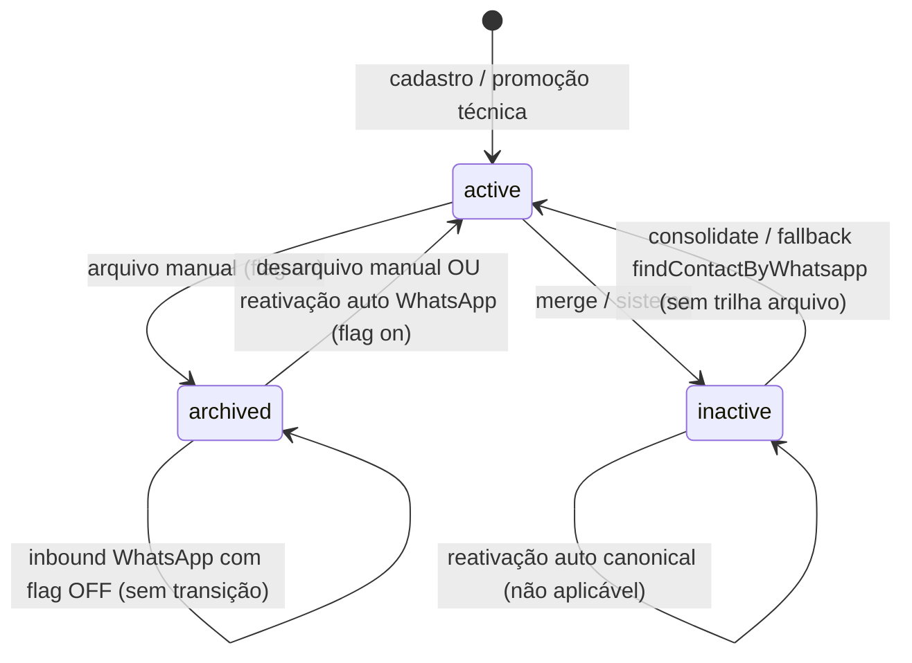
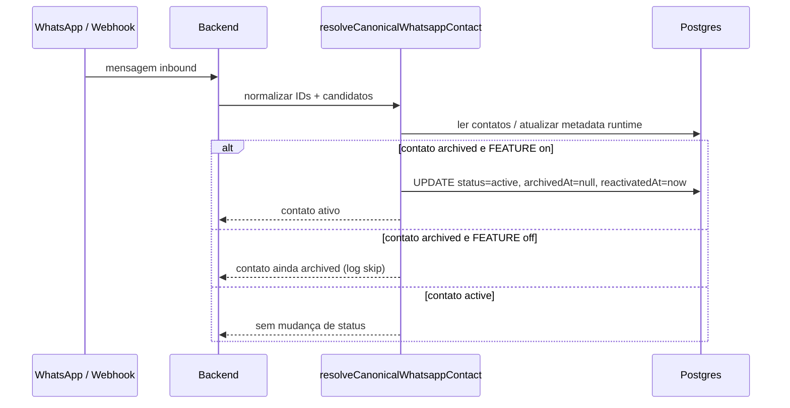
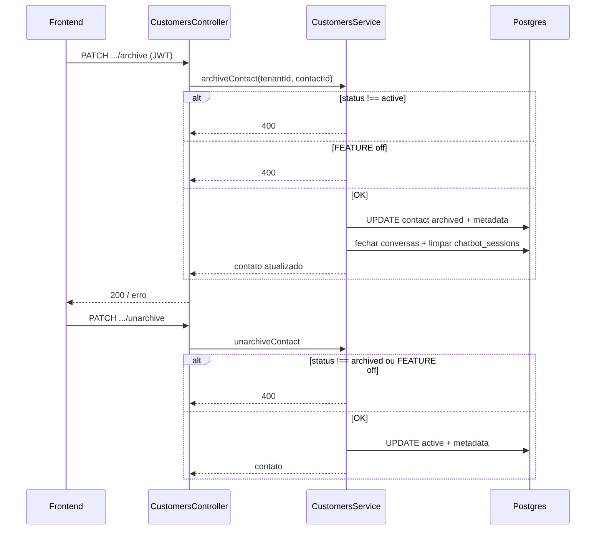

# 1. Visão Geral

Esta especificação descreve a **feature de arquivamento e reativação de contatos** no SempreDesk: estados do contato, fluxos manuais e automáticos, integração com WhatsApp, listagem, feature flag, observabilidade e integração frontend.

**Objetivos de negócio:**

- Permitir que operadores **ocultem** contatos da listagem padrão sem apagá-los (`archived`).
- **Reativar** automaticamente quando o cliente volta a interagir pelo WhatsApp (com trilha de auditoria em `metadata`).
- Manter **`inactive`** como estado de sistema (merge/remoção), sem reativação automática pelo mesmo caminho que `archived`.

**Escopo técnico:** backend NestJS + TypeORM (Postgres), frontend Next.js (dashboard), sem alteração do modelo relacional além do que já existia para `contacts.status` e `metadata` (JSONB).

---

# 2. Estados do Contato

| Estado | Significado | Visível na listagem padrão (`includeArchived=false`) | Reativação automática (WhatsApp) |
|--------|-------------|------------------------------------------------------|-----------------------------------|
| **active** | Contato em uso normal | Sim | N/A |
| **archived** | Arquivado explicitamente pelo usuário | Não | Sim (se `FEATURE_CONTACT_ARCHIVE` habilitada) |
| **inactive** | Marcação de sistema (merge/remoção) | Não | Não (nestes fluxos canônicos) |

Campos relevantes em **`metadata`** (JSONB), quando aplicável:

- `archivedAt` — ISO string ao arquivar; limpo ao reativar manualmente ou automaticamente nos caminhos previstos.
- `reactivatedAt` — ISO string ao reativar (manual ou automático nos caminhos previstos).

---

# 3. Regras de Negócio

1. Só é possível **arquivar** contato com status **`active`**.
2. Só é possível **desarquivar manualmente** contato com status **`archived`**.
3. **`inactive`** não é desarquivado pela UI de “Reativar”; outros fluxos podem promover `inactive` → `active` em contextos técnicos (consolidação / fallback), documentados na secção 7.
4. Contatos **`inactive`** **nunca** entram nas listagens `GET .../contacts` (nem com `includeArchived=true`).
5. Com **`FEATURE_CONTACT_ARCHIVE=false`**, o backend **bloqueia** arquivo/desarquivo manual (HTTP 400) e **não executa** reativação automática em `resolveCanonicalWhatsappContact` e `findOrCreateByWhatsapp`; mensagens WhatsApp não “quebram”, mas o contato pode permanecer `archived` até a flag voltar.
6. A reativação **automática** de `archived` **não** ocorre no fallback de `findContactByWhatsapp` (apenas log/warn + consolidação de vínculos), para preservar auditoria.

---

# 4. Arquivamento Manual

**Quem:** operador com permissão de edição de cliente (`customer.edit`).

**Fluxo:**

1. Validação: contato existe no tenant; `status === 'active'`.
2. Se `FEATURE_CONTACT_ARCHIVE` desabilitada → **400** + log `contact-archive-blocked`.
3. Persistência: `status = 'archived'`, `metadata.archivedAt = now`, preservando demais chaves de `metadata`.
4. Efeitos colaterais:
   - `UPDATE conversations` — conversas **active** do contato → `closed`.
   - `DELETE` em `chatbot_sessions` para o identificador WhatsApp do contato (quando houver).
5. Log estruturado `contact-archive-manual` + incremento de métrica `archiveManual`.

**Endpoint:** `PATCH /api/v1/customers/:id/contacts/:cid/archive` (o `:id` do cliente na URL é convencional; o serviço identifica o contato por `cid` + `tenantId`).

---

# 5. Desarquivamento Manual

**Quem:** operador com `customer.edit`.

**Fluxo:**

1. Contato existe; `status === 'archived'`.
2. Se feature flag off → **400** + log `contact-unarchive-blocked`.
3. `status = 'active'`, `metadata.archivedAt = null`, `metadata.reactivatedAt = now`.
4. Log `contact-unarchive-manual` + métrica `unarchiveManual`.

**Endpoint:** `PATCH /api/v1/customers/:id/contacts/:cid/unarchive`.

---

# 6. Reativação Automática

Ocorre quando há **contexto de mensagem WhatsApp inbound** (ou fluxo equivalente) e o contato canônico está **`archived`**.

## 6.1 `resolveCanonicalWhatsappContact`

- Após persistir identificadores de runtime (JID/LID/dígitos) quando aplicável.
- Se `safeContact.status === 'archived'`:
  - Se **feature flag on**: `status = 'active'`, `archivedAt = null`, `reactivatedAt = now`, log `contact-reactivation-auto` com `path: resolveCanonicalWhatsappContact`, métrica `autoReactivateCanonical`.
  - Se **flag off**: log `contact-reactivation-skipped` com `reason: FEATURE_CONTACT_ARCHIVE_DISABLED` — **sem** `UPDATE` de reativação.

## 6.2 `findOrCreateByWhatsapp` (fallback)

- Quando já existe contato por telefone/LID e `status === 'archived'` (caminho em que `resolveCanonicalWhatsappContact` não foi suficiente).
- Mesma regra de flag: se on, aplica metadata + `active` + log `path: findOrCreateByWhatsapp` + métrica `autoReactivateFindOrCreateFallback`; se off, apenas log de skip.

**Contatos `inactive`:** não são reativados por estes dois blocos.

---

# 7. Fallbacks e Comportamentos Especiais

## 7.1 `findContactByWhatsapp` (fallback sem match em `findContactByWhatsappOrLid`)

- Candidato **`inactive`**: promove para `active` (comportamento legado de sistema), log `contact-fallback-find-by-whatsapp` com `action: reactivate-inactive`, métrica `fallbackFindByWhatsappInactivePromoted`, depois `consolidateWhatsappContactLinks`.
- Candidato **`archived`**: **não** altera status; warn estruturado `archived-contact-in-findContactByWhatsapp-fallback`, métrica `fallbackFindByWhatsappArchivedSkippedLog`; consolida vínculos.

## 7.2 `consolidateWhatsappContactLinks`

- Se o **target** está `inactive`, pode setar `status = 'active'` (promoção técnica) + log `consolidate-whatsapp-links-status` / métrica `consolidateInactivePromotedToActive`.
- Se o target está **`archived`**, **não** altera `status` aqui (reativação fica para as camadas 6.1 / 6.2).

## 7.3 `findContactById`

Continua retornando o contato **independente do status** (uso pontual do painel); não faz parte da listagem CRM padrão.

---

# 8. Feature Flag

| Variável | Default | Desliga com |
|----------|---------|------------|
| `FEATURE_CONTACT_ARCHIVE` | habilitado (vazio/omitido) | `false`, `0`, `off`, `no`, `disabled` (case-insensitive) |

**Efeitos quando desligada:**

- `archiveContact` / `unarchiveContact` → **400** com mensagem referenciando a flag.
- Blocos de reativação automática em `resolveCanonicalWhatsappContact` e `findOrCreateByWhatsapp` → **skip** (log `contact-reactivation-skipped`).

**Observabilidade:** `GET /api/v1/monitoring/health` expõe `rollout.contactArchiveFeatureEnabled` (público). `GET /api/v1/monitoring/contact-archive-rollout` (super_admin) expõe `featureContactArchiveEnabled` e contadores + agregados SQL.

---

# 9. Listagem (`includeArchived`)

**Endpoint:** `GET /api/v1/customers/:clientId/contacts`

| Query | Filtro SQL equivalente |
|-------|-------------------------|
| (omitido) / `includeArchived=false` | `status = 'active'` |
| `includeArchived=true` | `status != 'inactive'` (inclui `active` + `archived`) |

O serviço aplica ainda `filterVisibleContactsForClient` (regras de WhatsApp canônico) coerentes com o modo de listagem.

**Uso interno:** `getClientOrFail` / `findAll` chamam `findContacts` **sem** `includeArchived` → apenas **active** nos objetos aninhados.

---

# 10. Integração Frontend

## 10.1 Ficha do cliente (`/dashboard/customers/[id]` — aba Contatos)

- Toggle **“Mostrar arquivados”** (sem `localStorage`).
- Busca flag: rollout com fallback para **health**.
- Badge **“Arquivado”**; botões **Arquivar** / **Reativar** apenas se flag habilitada.
- `PATCH` archive/unarchive + refetch da lista.

## 10.2 Novo ticket (`/dashboard/tickets/new`)

- Mesmo padrão de toggle + `getContacts(clientId, includeArchived)` + badge no select + flag carregada (paridade; sem botões de ação nesta tela).

---

# 11. Diagramas

## 11.1 Estados (Mermaid)



## 11.2 Sequência — WhatsApp inbound (reativação automática)



## 11.3 Sequência — Arquivar / Desarquivar (manual)



---

# 12. Endpoints REST

| Método | Caminho | Permissão | Descrição |
|--------|---------|-----------|-----------|
| `PATCH` | `/api/v1/customers/:id/contacts/:cid/archive` | `customer.edit` | Arquivar |
| `PATCH` | `/api/v1/customers/:id/contacts/:cid/unarchive` | `customer.edit` | Desarquivar |
| `GET` | `/api/v1/customers/:id/contacts` | `customer.view` | Lista; query `includeArchived` opcional |
| `GET` | `/api/v1/monitoring/health` | público | `rollout.contactArchiveFeatureEnabled` |
| `GET` | `/api/v1/monitoring/contact-archive-rollout` | JWT + `super_admin` | Flag + métricas processo + SQL |

---

# 13. Exemplos de Request/Response

## 13.1 Arquivar

**Request:**

```http
PATCH /api/v1/customers/CLIENT_UUID/contacts/CONTACT_UUID/archive
Authorization: Bearer <jwt>
```

**Response 200 (corpo típico — entidade Contact):**

```json
{
  "id": "CONTACT_UUID",
  "tenantId": "...",
  "status": "archived",
  "metadata": {
    "archivedAt": "2026-04-04T12:00:00.000Z"
  }
}
```

**Response 400 (já arquivado):**

```json
{
  "statusCode": 400,
  "message": "Contato já está arquivado."
}
```

## 13.2 Listar com arquivados

```http
GET /api/v1/customers/CLIENT_UUID/contacts?includeArchived=true
Authorization: Bearer <jwt>
```

Resposta: array de contatos `active` e `archived` (nunca `inactive`).

---

# 14. Logs Estruturados

Logs em JSON (uma linha), campo **`scope`** principal:

| scope | Quando |
|-------|--------|
| `contact-archive-manual` | Arquivo concluído |
| `contact-archive-blocked` | Tentativa com flag off |
| `contact-unarchive-manual` | Desarquivo OK |
| `contact-unarchive-blocked` | Bloqueio flag off |
| `contact-reactivation-auto` | Reativação inbound (paths no payload) |
| `contact-reactivation-skipped` | Flag off ou política archived no fallback |
| `contact-fallback-find-by-whatsapp` | Inactive reativado ou archived ignorado |
| `consolidate-whatsapp-links-status` | Promoção inactive→active no consolidate |

---

# 15. Métricas

**Em processo (reset por deploy):** `archiveManual`, `unarchiveManual`, `autoReactivateCanonical`, `autoReactivateFindOrCreateFallback`, `fallbackFindByWhatsappInactivePromoted`, `fallbackFindByWhatsappArchivedSkippedLog`, `consolidateInactivePromotedToActive`.

**SQL (rollout endpoint):** `totalArchivedContacts`, `activeWithReactivatedAtInLast24h`.

Recomenda-se derivar **taxas por hora** a partir dos logs no agregador (Datadog/Loki/etc.), não só dos contadores em RAM.

---

# 16. Troubleshooting

| Sintoma | Verificar |
|---------|-----------|
| Arquivar retorna 400 “desativado” | `FEATURE_CONTACT_ARCHIVE` no env do backend |
| Arquivado não some da lista | Frontend deve chamar lista **sem** `includeArchived` por defeito |
| WhatsApp não “reativa” contato | Flag off; ou fluxo não passa por `resolveCanonical`/`findOrCreate`; ou contato `inactive` |
| 403 no `/contact-archive-rollout` | Esperado para não–super_admin; usar `/monitoring/health` no frontend |
| Conversas ficaram abertas após arquivo | Regressão improvável — verificar `UPDATE conversations` em `archiveContact` |

---

# 17. Plano de Rollback

1. **Kill-switch imediato:** `FEATURE_CONTACT_ARCHIVE=false` + restart dos pods — sem migração de dados.
2. **Revert de versão:** deploy da imagem anterior; dados `archived` / `metadata` permanecem válidos.
3. **Dados:** não é necessário “desarquivar” em massa; ao religar a feature o estado reflete o BD.

Documento relacionado: `backend/docs/rollout-contact-archive.md` (checklist operacional).

---

# 18. Glossário

| Termo | Definição |
|-------|-----------|
| **Arquivar** | Transição `active` → `archived` com `archivedAt` e efeitos em conversas/chatbot |
| **Desarquivar** | Transição manual `archived` → `active` com limpeza de `archivedAt` e `reactivatedAt` |
| **Reativação automática** | `archived` → `active` disparada por inbound WhatsApp nos serviços indicados |
| **inactive** | Estado de sistema; fora das listagens públicas de contatos |
| **LID / JID** | Identificadores técnicos WhatsApp usados na resolução canônica |
| **includeArchived** | Query que inclui contatos `archived` na listagem por cliente |
| **FEATURE_CONTACT_ARCHIVE** | Flag de rollout para desligar manual + automático sem remover código |

---

*Documento gerado na Etapa 11 — especificação técnica da feature de arquivamento de contatos. Última revisão conceitual: alinhada ao backend e frontend do repositório SempreDesk.*
